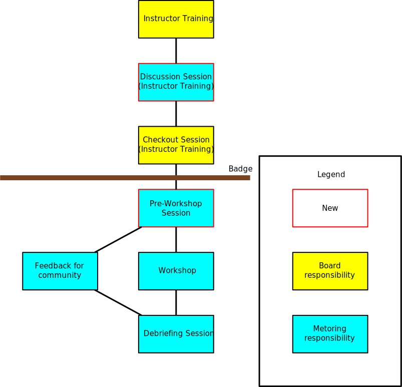

# Workflow

## Explanations

-   **Discussion Session** - question, answer and discussion session
    lead by one instructor that taught that lessons a few times in the last year.
-   **Checkout Session** - students delivery a 5 minutes lessons
    select by the instructor trainer leading the session.
-   **Pre-Workshop Session** - to be discussed, likely a troubleshooting
    session to make sure everything is on track in the final leadup to the
    workshop.
-   **Debriefing Session** and **Feedback for community**- read [this document](procedure-debriefing-session.md).
